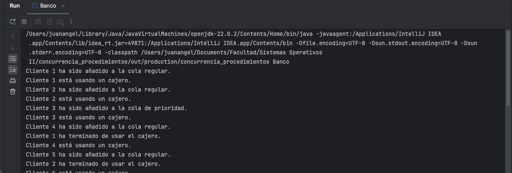
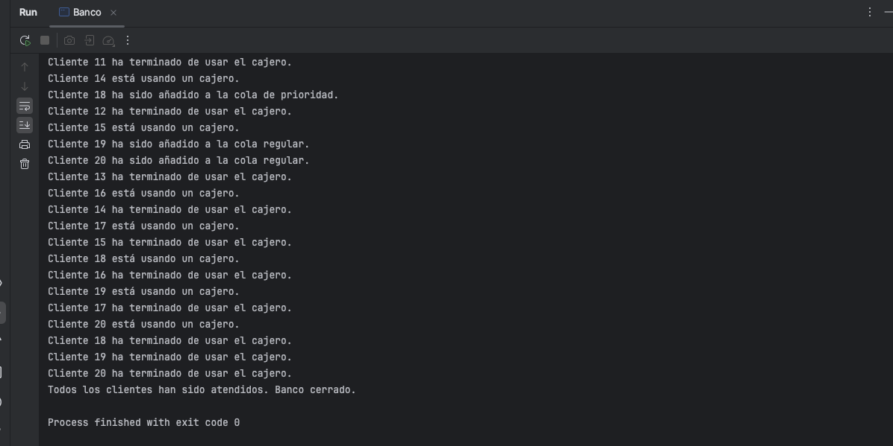

# Simulación de un Banco con Cajeros Concurrentes

## Descripción del Proyecto

Este proyecto simula la operación de un banco con un número limitado de cajeros automáticos. Los clientes llegan de manera concurrente y son atendidos de acuerdo con su prioridad (clientes regulares o de prioridad). El sistema asegura que no más de un número fijo de clientes puedan usar los cajeros simultáneamente.

-	¿Dónde pueden verse las consecuencias nocivas de la concurrencia? ¿Qué eventos pueden ocurrir que queramos controlar?
     Si no se controla el acceso a los cajeros, múltiples clientes podrían intentar usarlos al mismo tiempo, causando aglomeracion y malos ratos en la atencion a los clientes.
-	¿Hay eventos concurrentes para los cuales el ordenamiento relativo no resulta importante?
     No importa en qué orden específico los clientes utilicen los cajeros, mientras haya disponibilidad. Ademas, tenemos en cuenta la atencion con prioridad a personas de 3ra edad o mujeres embarazadas


---

## **Mecanismos de Sincronización Empleados**

1. **Semáforo (`Semaphore`):**
    - Controla el acceso concurrente a los cajeros.
    - Permite un número fijo de hilos (clientes) que pueden acceder simultáneamente.

2. **Bloqueo Explícito (`synchronized`):**
    - Garantiza acceso seguro a las estructuras compartidas (colas de clientes) durante las operaciones.

3. **Variables Atómicas (`AtomicInteger`):**
    - Usado para contar el número total de clientes atendidos de manera segura en un entorno concurrente.

4. **Join en Hilos (`Thread.join()`):**
    - Asegura que el hilo principal espere la finalización de todos los hilos de clientes antes de declarar el cierre del banco.

---

## **Lógica de Negocio**

1. **Componentes principales:**
    - **Cajeros Automáticos:** Número limitado de recursos representados por un semáforo.
    - **Clientes:** Se dividen en clientes de prioridad y clientes regulares.
    - **Colas:** Dos colas para manejar a los clientes según su prioridad.
    - **Contador de Clientes Atendidos:** Rastrea cuántos clientes han sido atendidos en total.

2. **Flujo de trabajo:**
    - Los clientes son generados aleatoriamente y colocados en la cola correspondiente.
    - Los clientes esperan su turno para usar un cajero disponible.
    - Después de ser atendidos, los clientes liberan el cajero y finalizan.
    - El banco cierra automáticamente cuando todos los clientes han sido atendidos.

---

## **Identificación del Estado Compartido**

1. **`Semaphore cajeros`:**
    - Representa el número de cajeros disponibles.
    - Compartido por todos los hilos para controlar el acceso concurrente.

2. **`Queue<String> colaRegular` y `Queue<String> colaPrioridad`:**
    - Colas sincronizadas que almacenan los clientes según su prioridad.

3. **`AtomicInteger clientesAtendidos`:**
    - Contador global que rastrea el número de clientes atendidos.

4. **`int totalClientes`:**
    - Número total de clientes a ser atendidos (parámetro configurable).

---

## **Descripción Algorítmica del Avance de cada Hilo/Proceso**

1. **Hilo Cliente:**
    - Se agrega a una cola de clientes (prioridad o regular).
    - Intenta adquirir un cajero (`Semaphore.acquire()`).
    - Usa el cajero por un tiempo simulado.
    - Libera el cajero (`Semaphore.release()`).
    - Incrementa el contador global de clientes atendidos.

2. **Hilo Principal:**
    - Genera clientes y asigna un hilo a cada cliente.
    - Espera a que todos los hilos terminen su ejecución (`Thread.join()`).
    - Verifica que todos los clientes hayan sido atendidos antes de cerrar el banco.

---

## **Descripción de la Interacción entre los Hilos**

1. **Acceso Concurrente a Cajeros:**
    - Controlado mediante semáforos, asegurando que solo un número limitado de clientes use los cajeros simultáneamente.

2. **Manejo de las Colas:**
    - Bloqueos explícitos garantizan que solo un hilo pueda acceder a las colas en cada momento.

3. **Actualización del Contador Global:**
    - Se realiza de forma atómica para evitar inconsistencias.

4. **Coordinación del Cierre:**
    - El hilo principal sincroniza su ejecución con los hilos de clientes para garantizar que no se declare el cierre hasta que todos los clientes hayan terminado.

---

## **Entorno de Desarrollo**

1. **Lenguaje:** Java
2. **Versión del Lenguaje:** JDK 22.
3. **Dependencias:**
    - Ninguna biblioteca adicional más allá de las estándar de Java (`java.util.concurrent`, `java.util`, etc.).
4. **Sistema Operativo utilizado:**
    - Windows y macOS.
5. **Herramienta Utilizada:**
    - IDE: IntelliJ IDEA.

---

## **Pasos para Reproducir la Ejecución**

1. Configura las siguientes variables en el método `main`:
    - `numeroDeCajeros`: Número de cajeros disponibles (ejemplo: 3).
    - `totalClientes`: Número total de clientes a atender (ejemplo: 20).

2. Compila y ejecuta el programa.

3. Observa la salida en la consola, donde:
    - Los clientes son atendidos en paralelo por los cajeros.
    - El banco se cierra automáticamente cuando todos los clientes han sido atendidos.

---

## **Ejemplo de Salida y ejecucion exitosa**

```plaintext
Cliente 1 ha sido añadido a la cola regular.
Cliente 2 ha sido añadido a la cola de prioridad.
Cliente 1 está usando un cajero.
Cliente 2 está usando un cajero.
Cliente 3 ha sido añadido a la cola regular.
Cliente 1 ha terminado de usar el cajero.
Cliente 3 está usando un cajero.
Cliente 2 ha terminado de usar el cajero.
...
Cliente 20 ha sido añadido a la cola de prioridad.
Cliente 20 está usando un cajero.
Cliente 20 ha terminado de usar el cajero.
Todos los clientes han sido atendidos. Banco cerrado.
```


